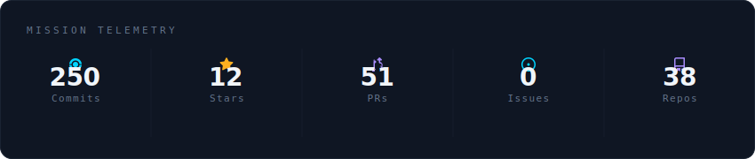

<!-- Galaxy Profile — auto-generated SVGs via GitHub Actions
     Run locally: python -m generator.main (or --demo for sample data) -->

  

 

  

 

  

 

  

 

<strong>More about me</strong>

 

I build production-ready web and mobile apps for SaaS, CRMs and dashboards.
Focus on performance, clean code organization and predictable delivery.

**Currently at** a8z — Brazil

I usually join as a hands-on engineer who can own the product end to end:
- **Frontend:** responsive interfaces, reusable components, accessibility and performance
- **Backend & APIs:** authentication, business rules, REST/webhooks integrations, logs and maintenance routines
- **Database & data:** modeling, queries, access policies, sync routines and data quality
- **Deploy & operations:** dev/stage/prod environments, release automations and basic monitoring

 

  
  
  
  

